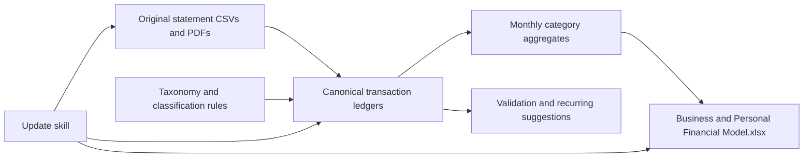

# Financial model pipeline overview

This document explains where financial-model files live, what owns each file, and how statement data reaches Excel. For field schemas and accounting rules, see [[REFERENCE]].

## Big picture



Original statements remain untouched. Pipeline rebuilds transaction ledgers from source files, applies persistent classification rules, validates balances and counts, creates monthly totals, updates temporary workbook copy, verifies it, then atomically promotes it.

## Current locations

Personal/business statement sources, live workbook, pipeline data root, active dates, and executable path come from `_system/agents/edit/settings/skills/config/spreadsheets-update-financial-model-from-statements/private/workflow.json`. Business statements remain business records. Existing validated CSVs import directly; matching PDFs remain source evidence unless future statement lacks validated CSV.

### Reusable update skill

- `_system/agents/edit/skills/_spreadsheets/spreadsheets-update-financial-model-from-statements`

Active paths, date window, currency, and expected row counts live in `_system/agents/edit/settings/skills/config/spreadsheets-update-financial-model-from-statements/private/workflow.json`.

## Source folders

Source folders contain bank-provided or previously extracted CSVs and PDFs. Pipeline hashes every discovered file, records provenance, and never modifies these folders.

Current import window comes from private workflow config. To extend model, change `through_date`, update expected row counts after validation, then rerun pipeline.

## Financial Model Data

### `taxonomy/`

- `categories.csv` defines stable category IDs, labels, parents, entity, flow type, workbook category, reporting status, active status, and whether category can feed automatic forecasts.
- `aliases.csv` translates older source labels into stable taxonomy.

Never reuse category ID for different meaning. Labels may change while ID remains stable.

### `rules/`

- `category_rules.csv` contains reusable exact-merchant, keyword, and regex classification rules.
- `transaction_overrides.csv` contains decisions applying to one transaction ID only.
- `recurring_rules.csv` contains recurring patterns deliberately adopted for recurring-versus-variable splits.
- `recurring_commitments.csv` defines reviewed rows written to workbook Recurring table, including amount, dates, escalation, active status, and evidence notes.

Classification precedence:

1. Transaction override
2. Transfer, owner-pay, or capital rule
3. Exact merchant rule
4. Keyword or regex rule
5. Existing category alias
6. Conservative agent judgment

Low-confidence decisions still import, but appear in run classification report.

### `ledgers/`

- `personal_transactions.csv` is canonical personal transaction history.
- `business_transactions.csv` is canonical business transaction history.

These are transaction-level source of truth. Each row includes source hash, source row, raw and normalized description, amounts, balance, direction, category, transfer pairing, recurring key, applied rule, confidence, reason, and status. Do not edit them manually; pipeline rebuilds them.

### `aggregates/`

- `personal_monthly.csv` contains workbook-ready personal totals.
- `business_monthly.csv` contains workbook-ready business totals.

Each row groups transactions by month, flow type, and workbook category. It also splits actual amount between recurring and variable components.

### `recurring/`

- `recurring_candidates.csv` contains detected repeated merchants or amounts.

Candidates never become forecast commitments automatically. Adoption requires dated match rule in `rules/recurring_rules.csv` plus reviewed commitment in `rules/recurring_commitments.csv`.

### `manifests/`

- `sources.csv` records every discovered source, hash, schema, date coverage, row count, included rows, and validation result.
- `state.json` combines source and rule hashes. It determines whether update is unchanged.
- `last_success.json` records last promoted workbook hash, backup, run folder, table row counts, and verification results.

### `backups/`

Contains timestamped workbook copies made before promotion. Use these for rollback. Pipeline never overwrites backup.

### `runs/`

Each invocation creates timestamped audit folder. Typical contents:

- `classification_review.csv` — low-confidence decisions
- `source_manifest.json` — source snapshot
- `validation.json` — reconciliation and count checks
- `workbook_payload.json` — exact data prepared for Excel
- `workbook_preservation.json` — manual workbook content preserved during rebuild
- `workbook_diff.json` — before/after hashes and table counts
- `workbook_result.json` — final status
- `rule_snapshots/` — rules used during run
- `renders/` — workbook images used for visual QA
- Witan logs and checkpoint files — timeout recovery

Historical run artifacts retain original paths from time run occurred. They are audit evidence, not active configuration. Old failed candidates may be pruned later after backups and successful run artifacts are retained.

### `extracted/`

Reserved for future PDF extraction bundles. Each bundle should preserve source hash, page evidence, adapter version, raw candidates, validation, and exceptions. Unknown PDF layout blocks workbook update.

## Workbook structure

One workbook contains multiple worksheets.

### User-facing sheets

- `Dashboard` — separates customer revenue, owner funding, core operating expenses, and business cash; also shows personal savings, net worth, charts, and status.
- `Business Forecast` — actual and forecast business cash flow plus manual scenario overrides.
- `Personal Monthly` — personal income, expenses, savings, and forecast summary.
- `Assets & Net Worth` — manual asset register plus monthly position snapshots.
- `Recurring` — recurring business and personal commitments chosen by user.
- `Setup & Checks` — model dates, actual-through controls, scenarios, assumptions, and checks.

### Pipeline-owned sheets

- `Business Actuals` contains `tblBusinessActuals` monthly category totals.
- `Personal Actuals` contains `tblPersonalMonthly` monthly category totals.
- `Pipeline Lists` supplies category validation lists.
- `Import Status` displays coverage, row counts, failures, hashes, and latest success.
- `Business Forecast Baseline` holds trailing-six-month business category averages.
- `Personal Forecast Baseline` holds trailing-six-month personal category averages.

Stable table names allow formulas to survive sheet relocation.

### Manual data preserved by pipeline

- Forecast overrides and additive adjustments
- Active recurring rows
- Notes and budget adjustments
- Manual assets and liabilities
- Non-pipeline rows

Pipeline automatically maintains only `Personal bank account` month-end net-worth snapshots. Other assets and liabilities remain manual.

## Classification and accounting behavior

- Internal transfers do not become income or expenses.
- Business owner pay appears once as business outflow and feeds personal income without duplicate matched deposit.
- Personal funding of business becomes business capital contribution, not personal expense.
- Savings and investment transfers remain non-expense asset movements.
- Fees post separately to bank-fee category.
- Matched refunds reduce original category.
- Business `accrued_bank_charges` remains informational and is not summed.

## Forecast behavior

Forecast combines:

1. Active rows from workbook `Recurring` table
2. Trailing-six-month average of non-recurring actuals
3. Manual scenario overrides and additive adjustments

Override precedence remains scenario-specific override, all-scenario override, baseline, then additive adjustment.

## What to edit

Normally edit:

- Workbook forecast overrides, assets, liabilities, notes, and budget adjustments
- `taxonomy/categories.csv` when category structure changes
- `rules/category_rules.csv` for reusable merchant decisions
- `rules/transaction_overrides.csv` for one-off correction
- `rules/recurring_rules.csv` when adopting recurring pattern
- `rules/recurring_commitments.csv` when activating, ending, or reviewing fixed commitments
- `_system/agents/edit/settings/skills/config/spreadsheets-update-financial-model-from-statements/private/workflow.json` when paths or import date window change

Do not manually edit pipeline-owned ledgers, aggregates, manifests, run logs, or Excel actual/baseline sheets.

## Future update flow

1. Add new statements to configured source folders.
2. Set desired `through_date` and expected row counts.
3. Run pipeline preparation and validation.
4. Review low-confidence classifications and update rules or overrides.
5. Rebuild ledgers and aggregates.
6. Update staged workbook with Witan.
7. Require zero formula errors; review lint and rendered sheets.
8. Back up and atomically promote verified candidate.
9. Rerun unchanged inputs and confirm workbook hash stays identical.

Primary command:

```bash
python3 scripts/update_financial_model.py --update-workbook
```

Use `--prepare-only` when rebuilding CSVs and validation artifacts without touching workbook.

## Current verified snapshot

As of 2026-07-16:

- Personal coverage: 2025-07-01 through 2026-06-30
- Personal transactions: 1,255
- Personal monthly aggregates: 190
- Personal bank snapshots: 12
- Business transactions: 153
- Business monthly aggregates: 42
- Low-confidence classifications: 79
- Workbook formula errors: 0
- Pipeline tests: 10 passing
